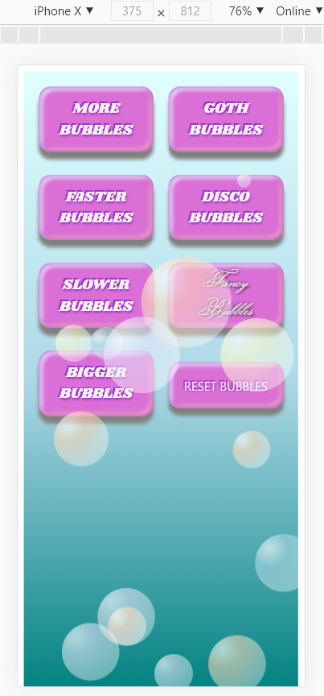
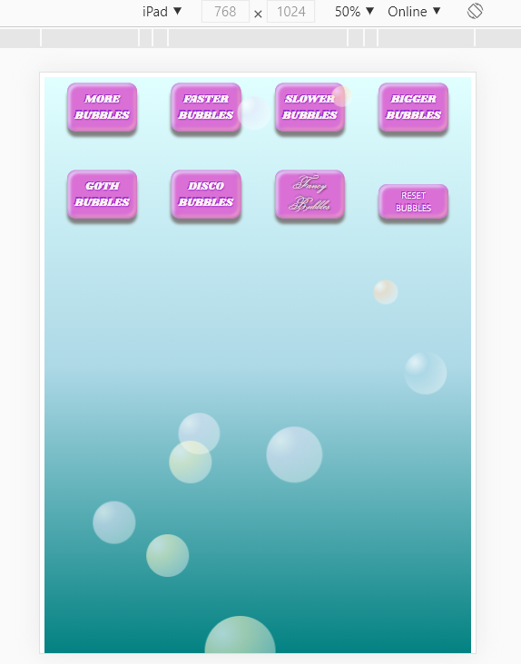
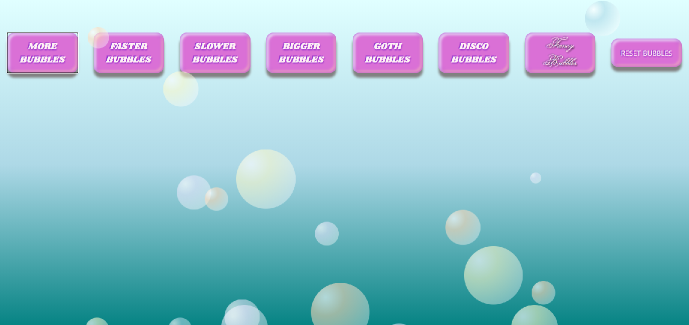
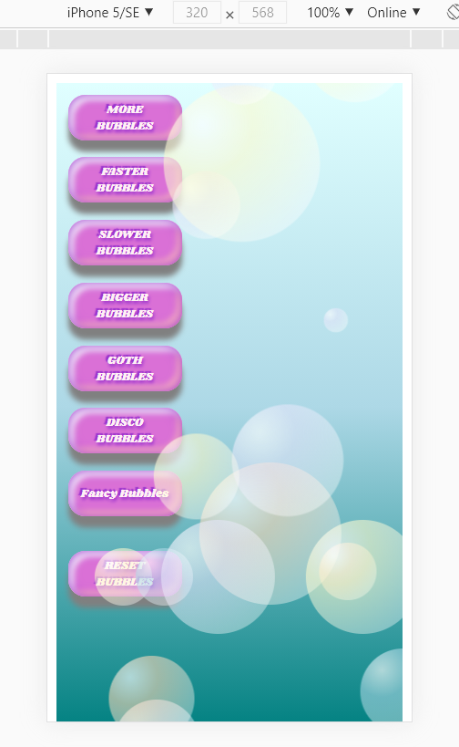

# BUBBLES
Project by Anne Ensign

**Demo**
https://eleanor-shellstrop.github.io/bubbles/

### About
This project is to demostrate what I've learned about Object-Oriented JavaScript and DOM maniupulation for Code Louisville's Front-End Web Development Course, Spring 2021. 

**Concept**

I wanted to learn how to use OOP in a way I could tangibly visualize. I also wanted to work with animations in CSS. The bubbles became a perfect tool for both. 

What started as a basic page with only "more bubbles" and "reset bubbles" buttons grew as I learned to target other elements on the page. 

Now, event listeners include:

* "MORE BUBBLES" button to add more bubbles.
* "FASTER BUBBLES" to speed up the bubbles every click.
* "SLOWER BUBBLES" to slow down the bubbles with every click.
* "BIGGER BUBBLES" to make them x2 larger.
* "GOTH," "DISCO," and "FANCY" buttons to change the appearance.
* "RESET BUBBLES" button to clear the screen.

The style buttons- goth, disco and fancy- can be applied at the same time as the "bigger" feature. All types can change speed at any time. 

### Mobile first design

This application was designed mobile screen sizes.

The media queries feature breaks at minimum screen widths of 750px and 1290px for a better viewing experience on tablets or pcs. The buttons will change from columns on the original size to two rows of four at 750px and one row of eight at 1290px.

While most phones today are over 360px wide, I have included a query for under 359px. Buttons will be displayed in a single column with smaller button size. Fonts, margins and padding all ajusted. 

### Features

**CSS**
* Display changes from flexbox to grid at 750px, then back to flexbox at 1290px.
* Animation of the bubbles from bottom of the screen to top, adjusting the scale of the bubble as it nears the top.

**JS**
* Class for objects: Bubble, Multibubble and Extrabubble.
  * Multibubble pushes to Bubble
  * Extrabubble extends Mutlibubble and supers functions.
* Multibubble.makeBubble() will randomly assign attributes to make varying bubbles:
  * Starting at a random point on the x-axis to generate.
  * Delay entrance to stagger bubbles.
  * Varying speed to top of screen between 1.5 - 6 seconds.
  * One of four colors.
  * One of six scale percentages so the bubble will increase or decrease as it moves to the top.
  * Starting point of one of five random diameters;
  * New bubbles will enter with whatever style is applied to the existing bubbles. 
    * For example, if you have disco bubbles on the screen and click "more bubbles," then the new bubbles will also be disco bubbles. 
* "Slower" and "faster" buttons iterate through every bubble and add and subtract (respectively) half a second. It must iterate because each bubble has a different speed to start. 

Image credits:
* Hat & monocle image: https://webstockreview.net/
* Disco ball image: https://www.stickpng.com/img/objects/party/disco-ball
* Disco floor image: by Ben Hanbury, https://www.Vimeo.com/83880963
* Rose image: https://wallpaperaccess.com/